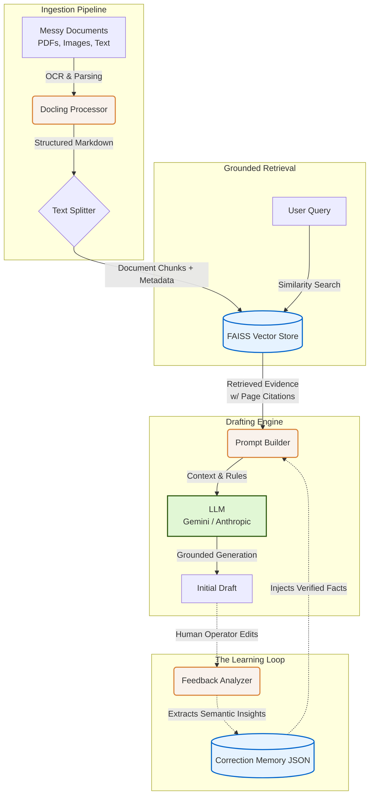

# Pearson Specter Litt: AI System Design

This flowchart visualizes the modular architecture of the Closed-Loop RAG system you built. It clearly separates the ingestion, retrieval, generation, and learning phases, making it perfect for explaining your system to the interviewers.

### How to Explain This Flow:

1. **Ingestion**: Explain that standard OCR isn't enough for legal docs. You chose **Docling** because it recovers structural elements (like tables and reading order) from messy PDFs and images, converting them into clean Markdown.
2. **Retrieval**: The Markdown is chunked and stored in a local **FAISS** vector database using `HuggingFaceEmbeddings`. Crucially, you attach source metadata (filename/page) to every chunk.
3. **Drafting**: When a query comes in, the system builds a prompt containing the retrieved evidence. You explicitly instruct the LLM to output inline citations (e.g., `[Source 1]`) so the operator can trace facts back to the original document.
4. **The "Secret Sauce" (Learning Loop)**: This is what sets your submission apart. Instead of throwing away user corrections, your system compares the original draft against the operator's edit. It extracts the *reason* for the change (a factual correction or stylistic preference) and stores it in a dynamic memory. The next time a draft is generated, this memory is injected into the prompt, ensuring the system never makes the same mistake twice.
